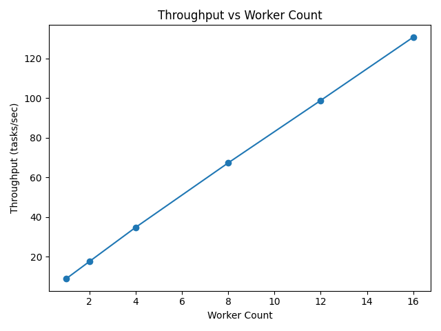
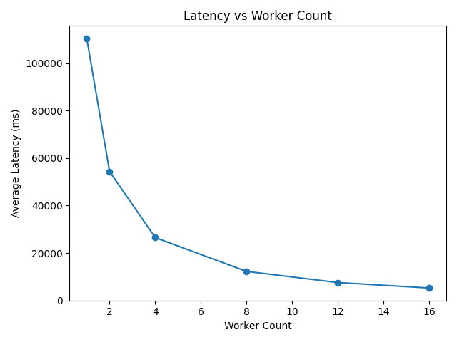

# Distributed C++ Task Queue

This project implements a reliable background job processing system using **C++, Redis, and multithreading**. A producer enqueues tasks in Redis, and a pool of worker threads retrieves and processes those tasks concurrently, allowing work to be executed asynchronously.

The system demonstrates practical distributed queue design patterns including **atomic task claiming, retry logic, dead-letter queues, crash recovery, and performance benchmarking**.

---

## Table of Contents

* [Architecture](#architecture)
* [Tech Stack](#tech-stack)
* [Results and Analysis](#results-and-analysis)
* [System Design](#system-design)
* [Metrics](#metrics)
* [Project Structure](#project-structure)
* [Building the Project](#building-the-project)
* [Running the System](#running-the-system)
* [Benchmarking and Scalability Study](#benchmarking-and-scalability-study)
* [Python Dependencies (Plotting)](#python-dependencies-plotting)

---

## Architecture

```
Producer
   │
   │ RPUSH
   ▼
Redis Queue (queue)
   │
   │ BLMOVE
   ▼
Processing Queue (queue:processing)
   │
   ▼
Worker Thread Pool
   │
   ├── success → remove task + record metrics
   └── failure → retry or move to dead-letter queue
```

The system follows a **producer → queue → worker pool** model. Tasks are pushed into Redis and processed asynchronously by worker threads. Redis serves as the task broker and provides atomic operations that guarantee safe task handoff between producers and workers.

---

## Tech Stack

### Language
- C++20

### Libraries
- Standard Template Library (STL)
- `nlohmann/json` for task serialization
- `redis-plus-plus` (Redis C++ client)

### Infrastructure
- Redis
- Docker / Docker Compose

### Build Tools
- CMake

---

## Results and Analysis

I conducted a horizontal scalability study using a fixed workload of **2,000 tasks** (each with a 500ms simulated processing delay). The system was benchmarked on an **Apple M2 (16GB)**, scaling from 1 to 16 worker containers.

### 1. Performance Benchmark Results
The system demonstrates near-perfect linear scalability, with throughput increasing proportionally to the number of worker containers.

| Workers | Throughput (tasks/s) | Avg Latency (ms) | Total Time (s) | Scaling Efficiency |
|:--- |:--- |:--- |:--- |:--- |
| 1 | 8.91 | 109,748 | 224.3 | 100.0% |
| 2 | 17.66 | 53,944 | 113.1 | 99.1% |
| 4 | 35.18 | 26,064 | 56.8 | 98.7% |
| 8 | 68.58 | 12,320 | 29.2 | 96.2% |
| 16 | 135.21 | 5,231 | 14.8 | 94.8% |

### Visualizations



### 2. Key Insights
* **Linear Throughput Growth**: The system achieved a **15.17x speedup** with 16 workers compared to a single worker. The transition from 1 to 2 workers (17.66 tasks/s) proves that the distribution logic is highly efficient with zero significant initial overhead.
* **Latency Mitigation**: Increasing the worker count from 1 to 16 reduced the average task turnaround time by **95.2%**. This highlights the system's effectiveness at handling high-volume bursts.
* **Stable Efficiency**: Even at 16 workers, the **Scaling Efficiency remained at ~95%**. This suggests that the Redis `BLMOVE` atomic operation successfully prevents "thundering herd" problems or lock contention at this scale.
* **Resource Overhead**: Redis CPU usage remained negligible (<0.6%), indicating that the C++ workers are the primary consumers of resources and the system is successfully CPU-bound rather than I/O-bound.

---

## System Design

The system consists of three primary components.

### Producer

The producer generates tasks, serializes them as JSON, and pushes them into a Redis list that acts as the pending task queue.

The producer is intentionally simple. Its role is only to enqueue work so the behavior of the worker system can be observed independently.

---

### Redis

Redis stores the task queues that producers write to and workers read from.

Three queues are used:

| Queue | Purpose |
|------|--------|
| `queue` | pending tasks waiting to be processed |
| `queue:processing` | tasks currently claimed by workers |
| `queue:dead_letter` | tasks that failed after retry attempts or are invalid |

Redis is well suited for this role because its list operations are **atomic** and support **blocking reads**, allowing workers to efficiently wait for new work without polling.

---

### Worker Pool

The consumer process launches a fixed pool of worker threads that repeatedly claim tasks and process them.

Limiting the number of worker threads reduces excessive context switching and improves CPU efficiency while still enabling parallel task processing.

---

### Task Lifecycle

Tasks move through several states during processing.

#### 1. Enqueue

The producer creates a task and pushes it into the Redis queue using `RPUSH`.

---

#### 2. Claiming Work

Workers claim tasks using Redis `BLMOVE`, which atomically moves a task from:

```
queue → queue:processing
```

This ensures tasks always exist in either the pending queue or processing queue.

---

#### 3. Processing

Once claimed, the worker:

- parses the JSON payload
- simulates work
- measures latency
- records completion metrics

If parsing fails or retries are exhausted, the task is moved to the **dead-letter queue**.

---

## Reliability Mechanisms

### Atomic Queue Transfers

`BLMOVE` ensures tasks are transferred between queues atomically, preventing tasks from being lost between claiming and processing.

---

### Crash Recovery

When the worker pool starts, any leftover tasks in `queue:processing` are moved back to the main queue. These tasks may have been interrupted by a crash or shutdown.

---

### Delivery Guarantee

The system provides **at-least-once task processing**.

Tasks are acknowledged only after successful completion. If a worker crashes mid-task, the task will be returned to the queue and retried during recovery.

---

## Metrics

Workers record basic performance metrics:

- completed task count
- total accumulated latency

Latency is measured from **task creation to completion**, enabling evaluation of system throughput and responsiveness during benchmarks.

---

## Project Structure

```
task-queue/
│
├── include/
│   ├── RedisHandler.h
│   ├── task.h
│   └── json.h
│
├── src/
│   ├── RedisHandler.cpp
│   ├── main.cpp
│   ├── producer_only.cpp
│   └── consumer_only.cpp
│
├── scripts/
│   ├── benchmark.sh
│   ├── scale_test.sh
│   └── plot_results.py
│
├── CMakeLists.txt
└── docker-compose.yml
```

---

## Building the Project

Install Redis development dependencies if needed:

```
sudo apt install libhiredis-dev
```

Build with CMake:

```
mkdir build
cd build
cmake ..
make
```

---

## Running the System

The system can be run in three ways depending on your workflow:

- **Local (manual)** — best for development and debugging
- **Local script** — quick one-command execution
- **Docker Compose** — reproducible environment for benchmarking

---

### Option A: Local Development

Start Redis:

```
redis-server
```

***Optional: clear previous state***

```
redis-cli DEL queue queue:processing queue:dead_letter completed_tasks total_latency_ms latency_count
```

Build the project:

```
cd build
cmake ..
make
cd ..
```

Start the worker pool:

```
./build/consumer 10
```

Run the producer in another terminal:

```
./build/producer 5000
```

---

### Option B: Convenience Script

```
chmod +x scripts/run_system.sh
./scripts/run_system.sh
```

This script builds the project, resets Redis state, runs the producer, and waits for the queue to drain.

---

### Option C: Docker Compose

Build services:

```
docker compose build
```

Start Redis and workers:

```
docker compose up -d redis worker
```

Run workload:

```
docker compose run --rm -T producer ./producer 5000
```

Stop services:

```
docker compose down
```

---

## Benchmarking and Scalability Study

Two scripts evaluate system performance.

Both run using **Docker Compose** to ensure reproducible environments.

---

### Workload Benchmark

```
scripts/benchmark.sh
```

This script:

1. resets the environment
2. builds containers
3. starts Redis and workers
4. runs the producer workload
5. waits for the queue to drain
6. collects metrics and logs

Outputs:

```
logs/benchmark/
```

Including:

- worker logs
- producer logs
- summary report

Metrics include:

- duration
- successful tasks
- retries
- dead-letter count
- average latency
- throughput

---

### Horizontal Scaling Test

```
scripts/scale_test.sh
```

This test measures how system performance changes as the number of worker containers increases.

Metrics recorded:

- throughput (tasks/sec)
- average latency
- total runtime
- Redis CPU usage
- worker CPU usage
- throughput per worker

Results are written to:

```
logs/scale/results.csv
```

---

## Python Dependencies (Plotting)

The scalability plots require the following Python packages:

* `pandas`
* `matplotlib`

Install with:

```
pip install pandas matplotlib
```

If your system Python is managed (e.g., Homebrew on macOS), create a virtual environment:

```
python3 -m venv venv
source venv/bin/activate
pip install pandas matplotlib
```